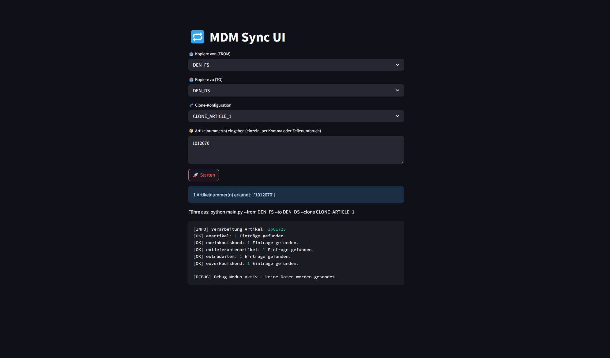

# MDM Clone App

This tool enables copying or cloning of product and condition data from one MDM system to another (e.g., from PROD to FS). It supports complex data models with linked entities such as articles, supplier articles, trade items, and purchase/sales conditions. It also provides a debug mode and cloning capabilities.

## 📦 Features
- API-based data export and blob-based data import
- Clone mode with new ID generation and relation updates
- Debug mode (export only, no upload)
- Optional UI for selecting source, target, config, and article numbers

## 🏗 Project Structure
```plaintext
├── main.py                 # Main control script
├── utils.py                # Helper functions
├── ui.py                   # Optional web UI (Streamlit)
├── config/
│   ├── env/                # Environment configs (API URLs, headers)
│   │   ├── example_Env.json
│   └── clone/              # Clone configurations (articles, conditions, etc.)
├── payloads/               # Template for API payloads
│   └── template.json
├── data/                   # Intermediate storage (get_entities.json and send_entities.json)
└── .gitignore              # Git filter rules
```

## 🛠 Setup
1. Clone the repository
2. Create and activate a virtual environment:
   ```bash
   python -m venv .venv
   source .venv/bin/activate  # macOS/Linux
   .venv\Scripts\activate     # Windows
   ```
3. Install dependencies:
   ```bash
   pip install -r requirements.txt
   ```
4. Copy `config/env/example_Env.json` and adapt it as `DEN_PROD.json`, `DEN_FS.json`, etc.
5. Create a `config/clone/` config for your use case (articles, conditions, etc.)

## ▶️ Usage

### Option A: Console
```bash
python main.py --from DEN_PROD --to DEN_FS --config CLONE_ARTICLE --articlenr eg. 1000000,1000001
```

### Option B: Web UI
```bash
streamlit run ui.py
```

Below is a preview of the Streamlit UI where you can select environments and article numbers:



## ⚙️ Example environment Config
```json
{
    "url_get": "https://{TENANT}.syndigo.com/api/entityappservice/get",
    "headers_get": {
      "x-rdp-version": "8.1",
      "x-rdp-clientId": "rdpclient",
      "x-rdp-userId": "{userID}",
      "x-rdp-useremail": "{userEmail}",
      "x-rdp-userRoles": "[\"systemadmin\"]",
      "auth-client-id": "{clientId}",
      "auth-client-secret": "{clientSecret}",
      "Content-Type": "application/json"
    },
    "url": "{URL_Blob_Import}",
    "headers": {
      "x-ms-blob-type": "BlockBlob"
    }
}
```

## 💡 Tips
- Enter article numbers via UI or directly in the config
- `debug: true` → exports only, no upload
- `clone: true` → generates new IDs, cleans attributes, fixes relations


---
Made with AI magic 🪄 by Simone

